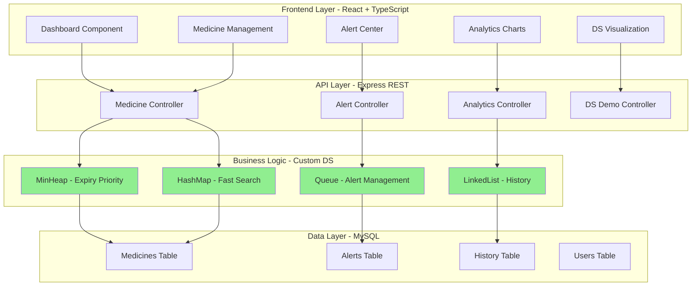
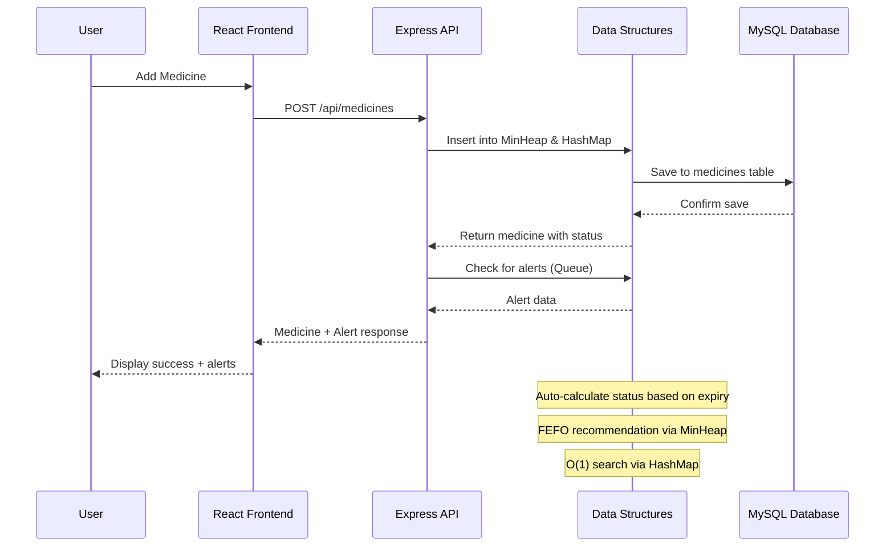

# Design Document: SmartMedGuard - Medicine Expiry, Stock & Safety Management System

## Overview

SmartMedGuard is a full-stack web application designed as a Data Structures & Algorithms college project that demonstrates practical implementations of core data structures while solving a real-world problem: medicine inventory management with expiry tracking. The system provides intelligent medicine management using Min-Heap for expiry prioritization, Hash Table for O(1) lookups, Queue for alert management, and Linked List for history tracking. Built with React + TypeScript frontend, Node.js + Express backend, and MySQL database, it features auto-calculated medicine status (Safe/Expiring Soon/Critical/Expired), FEFO (First Expire First Out) recommendations, smart multi-tier alerts (30-day, 7-day, 1-day warnings), real-time dashboard analytics with charts, premium healthcare SaaS UI with medical green theme, dark mode support, and a dedicated data structure visualization page for competitive programming demonstration.

The system architecture follows a three-tier pattern with clear separation between presentation (React), business logic (Node.js with custom data structure implementations), and persistence (MySQL) layers, enabling both educational demonstration of algorithm efficiency and practical deployment as a healthcare inventory management tool.

## Architecture



## Main Workflow



## Components and Interfaces

### Component 1: MinHeap (Expiry Priority Queue)

**Purpose**: Maintains medicines sorted by expiry date for FEFO recommendations and critical expiry identification

**Interface**:
```typescript
interface IMedicine {
  id: string;
  name: string;
  batchNumber: string;
  expiryDate: Date;
  quantity: number;
  category: string;
  manufacturer: string;
  price: number;
  status: 'Safe' | 'Expiring Soon' | 'Critical' | 'Expired';
}

class MinHeap {
  private heap: IMedicine[];
  
  constructor();
  
  // Insert medicine with O(log n) complexity
  insert(medicine: IMedicine): void;
  
  // Extract medicine with earliest expiry - O(log n)
  extractMin(): IMedicine | null;
  
  // Peek at next-to-expire medicine - O(1)
  peekMin(): IMedicine | null;
  
  // Get all medicines expiring within days - O(n)
  getMedicinesExpiringWithin(days: number): IMedicine[];
  
  // Get top N medicines by expiry - O(n log n)
  getTopNExpiring(n: number): IMedicine[];
  
  // Remove specific medicine - O(n)
  remove(id: string): boolean;
  
  // Update medicine and reheapify - O(n)
  update(id: string, updates: Partial<IMedicine>): boolean;
  
  // Helper methods
  private heapifyUp(index: number): void;
  private heapifyDown(index: number): void;
  private swap(i: number, j: number): void;
  private compare(a: IMedicine, b: IMedicine): number;
}
```

**Responsibilities**:
- Maintain medicines sorted by expiry date using min-heap property
- Provide O(log n) insertion and extraction
- Support FEFO (First Expire First Out) recommendations
- Identify critical and expiring medicines efficiently
- Enable real-time priority-based access to medicines

### Component 2: HashMap (Fast Medicine Search)

**Purpose**: Provides O(1) average-case lookup for medicines by ID, name, or batch number

**Interface**:
```typescript
interface IHashMap<K, V> {
  set(key: K, value: V): void;
  get(key: K): V | undefined;
  has(key: K): boolean;
  delete(key: K): boolean;
  size(): number;
  clear(): void;
}

class MedicineHashMap implements IHashMap<string, IMedicine> {
  private buckets: Array<Array<{key: string, value: IMedicine}>>;
  private capacity: number;
  private loadFactor: number;
  private _size: number;
  
  constructor(initialCapacity?: number, loadFactor?: number);
  
  // Core operations - O(1) average case
  set(key: string, value: IMedicine): void;
  get(key: string): IMedicine | undefined;
  has(key: string): boolean;
  delete(key: string): boolean;
  
  // Search operations
  searchByName(name: string): IMedicine[];
  searchByBatch(batchNumber: string): IMedicine | undefined;
  searchByCategory(category: string): IMedicine[];
  
  // Utility methods
  size(): number;
  clear(): void;
  getAllMedicines(): IMedicine[];
  
  // Private helpers
  private hash(key: string): number;
  private resize(): void;
  private shouldResize(): boolean;
}
```

**Responsibilities**:
- Provide constant-time medicine lookup by ID
- Support fast search by name, batch number, and category
- Manage automatic resizing when load factor exceeded
- Handle collision resolution via chaining
- Enable efficient medicine updates and deletions

### Component 3: AlertQueue (Alert Management)

**Purpose**: Manages medicine alerts in FIFO order with priority levels (30-day, 7-day, 1-day warnings)

**Interface**:
```typescript
interface IAlert {
  id: string;
  medicineId: string;
  medicineName: string;
  type: 'EXPIRING_30' | 'EXPIRING_7' | 'EXPIRING_1' | 'EXPIRED' | 'LOW_STOCK';
  severity: 'info' | 'warning' | 'critical';
  message: string;
  createdAt: Date;
  isRead: boolean;
}

class AlertQueue {
  private queue: IAlert[];
  private front: number;
  private rear: number;
  private maxSize: number;
  
  constructor(maxSize?: number);
  
  // Core queue operations - O(1)
  enqueue(alert: IAlert): boolean;
  dequeue(): IAlert | null;
  peek(): IAlert | null;
  
  // Alert-specific operations
  getUnreadAlerts(): IAlert[];
  getAlertsByType(type: IAlert['type']): IAlert[];
  getAlertsBySeverity(severity: IAlert['severity']): IAlert[];
  markAsRead(alertId: string): boolean;
  
  // Utility methods
  isEmpty(): boolean;
  isFull(): boolean;
  size(): number;
  clear(): void;
  
  // Generate alerts for medicine
  generateAlertsForMedicine(medicine: IMedicine): IAlert[];
}
```

**Responsibilities**:
- Maintain alerts in FIFO order
- Support multi-tier alert system (30/7/1 day warnings)
- Categorize alerts by severity and type
- Track read/unread status
- Generate alerts automatically based on medicine expiry dates
- Provide efficient alert filtering and retrieval

### Component 4: HistoryLinkedList (Activity History)

**Purpose**: Maintains chronological history of medicine operations using doubly linked list

**Interface**:
```typescript
interface IHistoryEntry {
  id: string;
  action: 'ADD' | 'UPDATE' | 'DELETE' | 'DISPENSE';
  medicineId: string;
  medicineName: string;
  details: string;
  timestamp: Date;
  userId?: string;
}

class HistoryNode {
  data: IHistoryEntry;
  next: HistoryNode | null;
  prev: HistoryNode | null;
  
  constructor(data: IHistoryEntry);
}

class HistoryLinkedList {
  private head: HistoryNode | null;
  private tail: HistoryNode | null;
  private _size: number;
  
  constructor();
  
  // Core operations
  addToFront(entry: IHistoryEntry): void;  // O(1)
  addToBack(entry: IHistoryEntry): void;   // O(1)
  removeFromFront(): IHistoryEntry | null; // O(1)
  removeFromBack(): IHistoryEntry | null;  // O(1)
  
  // History-specific operations
  getRecentHistory(count: number): IHistoryEntry[];
  getHistoryByMedicineId(medicineId: string): IHistoryEntry[];
  getHistoryByAction(action: IHistoryEntry['action']): IHistoryEntry[];
  getHistoryInRange(startDate: Date, endDate: Date): IHistoryEntry[];
  
  // Search operations
  find(predicate: (entry: IHistoryEntry) => boolean): IHistoryEntry | null;
  filter(predicate: (entry: IHistoryEntry) => boolean): IHistoryEntry[];
  
  // Utility methods
  size(): number;
  isEmpty(): boolean;
  clear(): void;
  toArray(): IHistoryEntry[];
}
```

**Responsibilities**:
- Maintain chronological history of all medicine operations
- Support efficient insertion at both ends (O(1))
- Enable bidirectional traversal of history
- Provide filtering by medicine, action type, and date range
- Support undo/redo functionality potential
- Track user actions for audit trail

### Component 5: Medicine Status Calculator

**Purpose**: Auto-calculates medicine status based on expiry date

**Interface**:
```typescript
enum MedicineStatus {
  Safe = 'Safe',           // > 30 days to expiry
  ExpiringSoon = 'Expiring Soon',  // 8-30 days to expiry
  Critical = 'Critical',   // 1-7 days to expiry
  Expired = 'Expired'      // Already expired
}

class StatusCalculator {
  // Calculate status based on expiry date - O(1)
  static calculateStatus(expiryDate: Date, currentDate?: Date): MedicineStatus;
  
  // Get days until expiry - O(1)
  static getDaysUntilExpiry(expiryDate: Date, currentDate?: Date): number;
  
  // Check if medicine needs alert - O(1)
  static needsAlert(expiryDate: Date, currentDate?: Date): boolean;
  
  // Get alert severity - O(1)
  static getAlertSeverity(daysUntilExpiry: number): 'info' | 'warning' | 'critical';
  
  // Batch calculate status for multiple medicines - O(n)
  static batchCalculateStatus(medicines: IMedicine[]): Map<string, MedicineStatus>;
}
```

**Responsibilities**:
- Auto-calculate medicine status based on expiry date
- Define status thresholds (>30 days, 8-30 days, 1-7 days, expired)
- Determine alert requirements
- Support batch status calculations for dashboard
- Provide consistent status logic across system

## Data Models

### Model 1: Medicine

```typescript
interface IMedicine {
  // Primary identifiers
  id: string;              // UUID
  batchNumber: string;     // Unique batch identifier
  
  // Medicine information
  name: string;
  category: string;        // e.g., "Antibiotic", "Painkiller", "Vitamin"
  manufacturer: string;
  description?: string;
  
  // Stock and pricing
  quantity: number;        // Current stock quantity
  unit: string;           // e.g., "tablets", "bottles", "boxes"
  price: number;          // Unit price
  lowStockThreshold: number; // Alert when quantity below this
  
  // Expiry management
  expiryDate: Date;
  manufactureDate: Date;
  status: 'Safe' | 'Expiring Soon' | 'Critical' | 'Expired';
  
  // Metadata
  createdAt: Date;
  updatedAt: Date;
  createdBy?: string;
}
```

**Validation Rules**:
- `id` must be valid UUID
- `name` must be 1-200 characters, non-empty
- `batchNumber` must be unique, alphanumeric, 1-50 characters
- `quantity` must be non-negative integer
- `price` must be positive number
- `expiryDate` must be future date when created
- `manufactureDate` must be before `expiryDate`
- `lowStockThreshold` must be non-negative, less than initial quantity
- `status` is auto-calculated, not user-input

### Model 2: Alert

```typescript
interface IAlert {
  // Identifiers
  id: string;              // UUID
  medicineId: string;      // Foreign key to medicine
  
  // Alert information
  type: 'EXPIRING_30' | 'EXPIRING_7' | 'EXPIRING_1' | 'EXPIRED' | 'LOW_STOCK';
  severity: 'info' | 'warning' | 'critical';
  message: string;
  
  // Medicine details (denormalized for quick access)
  medicineName: string;
  batchNumber: string;
  expiryDate: Date;
  daysUntilExpiry?: number;
  
  // Alert status
  isRead: boolean;
  isAcknowledged: boolean;
  acknowledgedBy?: string;
  acknowledgedAt?: Date;
  
  // Metadata
  createdAt: Date;
}
```

**Validation Rules**:
- `id` must be valid UUID
- `medicineId` must reference existing medicine
- `type` must be one of enum values
- `severity` must match type (EXPIRING_1/EXPIRED → critical, EXPIRING_7 → warning, EXPIRING_30 → info)
- `message` auto-generated based on type
- `isRead` defaults to false
- `createdAt` auto-set on creation

### Model 3: History Entry

```typescript
interface IHistoryEntry {
  // Identifiers
  id: string;              // UUID
  medicineId: string;      // Foreign key to medicine
  userId?: string;         // User who performed action
  
  // Action details
  action: 'ADD' | 'UPDATE' | 'DELETE' | 'DISPENSE';
  details: string;         // Human-readable description
  
  // Medicine snapshot (at time of action)
  medicineName: string;
  batchNumber: string;
  quantityBefore?: number;
  quantityAfter?: number;
  
  // Change tracking
  changes?: Record<string, {before: any, after: any}>;
  
  // Metadata
  timestamp: Date;
}
```

**Validation Rules**:
- `id` must be valid UUID
- `medicineId` must reference medicine (or deleted medicine ID)
- `action` must be one of enum values
- `details` must be non-empty string
- `timestamp` auto-set on creation
- `changes` stored as JSON for UPDATE actions

### Model 4: User (for authentication)

```typescript
interface IUser {
  id: string;              // UUID
  username: string;
  email: string;
  passwordHash: string;
  role: 'admin' | 'pharmacist' | 'viewer';
  
  // Settings
  preferences: {
    theme: 'light' | 'dark';
    alertNotifications: boolean;
    dashboardLayout?: string;
  };
  
  // Metadata
  createdAt: Date;
  lastLogin?: Date;
}
```

**Validation Rules**:
- `username` must be unique, 3-30 characters, alphanumeric
- `email` must be valid email format, unique
- `passwordHash` stored using bcrypt
- `role` defaults to 'viewer'

## Database Schema

```sql
-- Medicines table
CREATE TABLE medicines (
  id VARCHAR(36) PRIMARY KEY,
  batch_number VARCHAR(50) UNIQUE NOT NULL,
  name VARCHAR(200) NOT NULL,
  category VARCHAR(100) NOT NULL,
  manufacturer VARCHAR(200) NOT NULL,
  description TEXT,
  quantity INT NOT NULL DEFAULT 0,
  unit VARCHAR(50) NOT NULL DEFAULT 'tablets',
  price DECIMAL(10, 2) NOT NULL,
  low_stock_threshold INT NOT NULL DEFAULT 10,
  expiry_date DATE NOT NULL,
  manufacture_date DATE NOT NULL,
  status ENUM('Safe', 'Expiring Soon', 'Critical', 'Expired') NOT NULL,
  created_at TIMESTAMP DEFAULT CURRENT_TIMESTAMP,
  updated_at TIMESTAMP DEFAULT CURRENT_TIMESTAMP ON UPDATE CURRENT_TIMESTAMP,
  created_by VARCHAR(36),
  INDEX idx_expiry_date (expiry_date),
  INDEX idx_status (status),
  INDEX idx_category (category),
  INDEX idx_batch_number (batch_number)
);

-- Alerts table
CREATE TABLE alerts (
  id VARCHAR(36) PRIMARY KEY,
  medicine_id VARCHAR(36) NOT NULL,
  type ENUM('EXPIRING_30', 'EXPIRING_7', 'EXPIRING_1', 'EXPIRED', 'LOW_STOCK') NOT NULL,
  severity ENUM('info', 'warning', 'critical') NOT NULL,
  message TEXT NOT NULL,
  medicine_name VARCHAR(200) NOT NULL,
  batch_number VARCHAR(50) NOT NULL,
  expiry_date DATE NOT NULL,
  days_until_expiry INT,
  is_read BOOLEAN DEFAULT FALSE,
  is_acknowledged BOOLEAN DEFAULT FALSE,
  acknowledged_by VARCHAR(36),
  acknowledged_at TIMESTAMP,
  created_at TIMESTAMP DEFAULT CURRENT_TIMESTAMP,
  FOREIGN KEY (medicine_id) REFERENCES medicines(id) ON DELETE CASCADE,
  INDEX idx_medicine_id (medicine_id),
  INDEX idx_type (type),
  INDEX idx_is_read (is_read),
  INDEX idx_created_at (created_at)
);

-- History table
CREATE TABLE history (
  id VARCHAR(36) PRIMARY KEY,
  medicine_id VARCHAR(36) NOT NULL,
  user_id VARCHAR(36),
  action ENUM('ADD', 'UPDATE', 'DELETE', 'DISPENSE') NOT NULL,
  details TEXT NOT NULL,
  medicine_name VARCHAR(200) NOT NULL,
  batch_number VARCHAR(50) NOT NULL,
  quantity_before INT,
  quantity_after INT,
  changes JSON,
  timestamp TIMESTAMP DEFAULT CURRENT_TIMESTAMP,
  INDEX idx_medicine_id (medicine_id),
  INDEX idx_action (action),
  INDEX idx_timestamp (timestamp),
  INDEX idx_user_id (user_id)
);

-- Users table
CREATE TABLE users (
  id VARCHAR(36) PRIMARY KEY,
  username VARCHAR(30) UNIQUE NOT NULL,
  email VARCHAR(255) UNIQUE NOT NULL,
  password_hash VARCHAR(255) NOT NULL,
  role ENUM('admin', 'pharmacist', 'viewer') DEFAULT 'viewer',
  preferences JSON,
  created_at TIMESTAMP DEFAULT CURRENT_TIMESTAMP,
  last_login TIMESTAMP,
  INDEX idx_username (username),
  INDEX idx_email (email)
);
```

## API Endpoints

### Medicine Endpoints

```typescript
// GET /api/medicines - Get all medicines
interface GetMedicinesResponse {
  medicines: IMedicine[];
  total: number;
  stats: {
    safe: number;
    expiringSoon: number;
    critical: number;
    expired: number;
  };
}

// GET /api/medicines/:id - Get medicine by ID
interface GetMedicineResponse {
  medicine: IMedicine;
  alerts: IAlert[];
  history: IHistoryEntry[];
}

// POST /api/medicines - Add new medicine
interface AddMedicineRequest {
  name: string;
  batchNumber: string;
  category: string;
  manufacturer: string;
  quantity: number;
  unit: string;
  price: number;
  lowStockThreshold: number;
  expiryDate: string;  // ISO date string
  manufactureDate: string;
  description?: string;
}

// PUT /api/medicines/:id - Update medicine
interface UpdateMedicineRequest extends Partial<AddMedicineRequest> {}

// DELETE /api/medicines/:id - Delete medicine

// GET /api/medicines/expiring - Get medicines expiring soon (FEFO)
interface GetExpiringMedicinesResponse {
  medicines: IMedicine[];
  fefoRecommendations: IMedicine[];  // Top 10 by expiry
}

// GET /api/medicines/search?q=query - Search medicines
interface SearchMedicinesResponse {
  medicines: IMedicine[];
  searchTerm: string;
}

// POST /api/medicines/:id/dispense - Dispense medicine (reduce quantity)
interface DispenseMedicineRequest {
  quantity: number;
  notes?: string;
}
```

### Alert Endpoints

```typescript
// GET /api/alerts - Get all alerts
interface GetAlertsResponse {
  alerts: IAlert[];
  unreadCount: number;
  criticalCount: number;
}

// GET /api/alerts/unread - Get unread alerts

// PUT /api/alerts/:id/read - Mark alert as read

// PUT /api/alerts/:id/acknowledge - Acknowledge alert

// DELETE /api/alerts/:id - Delete alert

// POST /api/alerts/generate - Manually trigger alert generation
```

### Analytics Endpoints

```typescript
// GET /api/analytics/dashboard - Get dashboard statistics
interface DashboardAnalytics {
  totalMedicines: number;
  totalValue: number;
  statusBreakdown: {
    safe: number;
    expiringSoon: number;
    critical: number;
    expired: number;
  };
  categoryBreakdown: Record<string, number>;
  expiryTimeline: Array<{date: string, count: number}>;
  recentActivity: IHistoryEntry[];
  topExpiring: IMedicine[];
  lowStock: IMedicine[];
}

// GET /api/analytics/trends - Get trend data
interface TrendAnalytics {
  expiryTrend: Array<{month: string, expired: number, expiring: number}>;
  stockTrend: Array<{month: string, added: number, dispensed: number}>;
  categoryTrend: Record<string, number[]>;
}
```

### Data Structure Visualization Endpoints

```typescript
// GET /api/ds/minheap - Get MinHeap visualization data
interface MinHeapVisualization {
  structure: 'minheap';
  nodes: Array<{
    id: string;
    medicine: IMedicine;
    level: number;
    position: number;
  }>;
  complexity: {
    insert: 'O(log n)';
    extractMin: 'O(log n)';
    peekMin: 'O(1)';
  };
}

// GET /api/ds/hashmap - Get HashMap visualization data
interface HashMapVisualization {
  structure: 'hashmap';
  buckets: Array<{
    index: number;
    entries: Array<{key: string, medicine: IMedicine}>;
  }>;
  loadFactor: number;
  collisions: number;
  complexity: {
    insert: 'O(1) avg';
    search: 'O(1) avg';
    delete: 'O(1) avg';
  };
}

// GET /api/ds/queue - Get Queue visualization data
interface QueueVisualization {
  structure: 'queue';
  items: IAlert[];
  front: number;
  rear: number;
  complexity: {
    enqueue: 'O(1)';
    dequeue: 'O(1)';
  };
}

// GET /api/ds/linkedlist - Get LinkedList visualization data
interface LinkedListVisualization {
  structure: 'linkedlist';
  nodes: Array<{
    data: IHistoryEntry;
    hasNext: boolean;
    hasPrev: boolean;
  }>;
  complexity: {
    insertFront: 'O(1)';
    insertBack: 'O(1)';
    search: 'O(n)';
  };
}
```

## Data Structure Implementations

### Implementation 1: MinHeap for Expiry Priority

```typescript
class MinHeap {
  private heap: IMedicine[];
  
  constructor() {
    this.heap = [];
  }
  
  /**
   * Insert medicine into heap
   * Preconditions: medicine is valid IMedicine object
   * Postconditions: medicine added to heap, min-heap property maintained
   * Time Complexity: O(log n)
   */
  insert(medicine: IMedicine): void {
    this.heap.push(medicine);
    this.heapifyUp(this.heap.length - 1);
  }
  
  /**
   * Extract medicine with earliest expiry date
   * Preconditions: heap is not empty
   * Postconditions: returns and removes root element, heap property maintained
   * Time Complexity: O(log n)
   */
  extractMin(): IMedicine | null {
    if (this.heap.length === 0) return null;
    if (this.heap.length === 1) return this.heap.pop()!;
    
    const min = this.heap[0];
    this.heap[0] = this.heap.pop()!;
    this.heapifyDown(0);
    
    return min;
  }
  
  /**
   * Peek at medicine with earliest expiry without removing
   * Preconditions: none
   * Postconditions: returns root element or null, heap unchanged
   * Time Complexity: O(1)
   */
  peekMin(): IMedicine | null {
    return this.heap.length > 0 ? this.heap[0] : null;
  }
  
  /**
   * Get all medicines expiring within specified days
   * Preconditions: days >= 0
   * Postconditions: returns array of medicines expiring within days
   * Time Complexity: O(n)
   */
  getMedicinesExpiringWithin(days: number): IMedicine[] {
    const cutoffDate = new Date();
    cutoffDate.setDate(cutoffDate.getDate() + days);
    
    return this.heap.filter(medicine => 
      medicine.expiryDate <= cutoffDate && medicine.expiryDate >= new Date()
    );
  }
  
  /**
   * Get top N medicines by earliest expiry
   * Preconditions: n > 0
   * Postconditions: returns array of N medicines with earliest expiry dates
   * Time Complexity: O(n log n) - creates copy and extracts N times
   */
  getTopNExpiring(n: number): IMedicine[] {
    const result: IMedicine[] = [];
    const tempHeap = new MinHeap();
    
    // Copy heap
    this.heap.forEach(m => tempHeap.insert(m));
    
    // Extract N times
    for (let i = 0; i < n && tempHeap.size() > 0; i++) {
      const min = tempHeap.extractMin();
      if (min) result.push(min);
    }
    
    return result;
  }
  
  /**
   * Remove medicine by ID
   * Preconditions: none
   * Postconditions: if found, medicine removed and heap property maintained
   * Time Complexity: O(n) - linear search + O(log n) heapify
   */
  remove(id: string): boolean {
    const index = this.heap.findIndex(m => m.id === id);
    if (index === -1) return false;
    
    // Swap with last element
    this.swap(index, this.heap.length - 1);
    this.heap.pop();
    
    // Reheapify from index
    if (index < this.heap.length) {
      this.heapifyDown(index);
      this.heapifyUp(index);
    }
    
    return true;
  }
  
  /**
   * Update medicine and maintain heap property
   * Preconditions: id exists in heap
   * Postconditions: medicine updated, heap property maintained
   * Time Complexity: O(n) - search + O(log n) heapify
   */
  update(id: string, updates: Partial<IMedicine>): boolean {
    const index = this.heap.findIndex(m => m.id === id);
    if (index === -1) return false;
    
    Object.assign(this.heap[index], updates);
    
    // Reheapify - could move up or down
    this.heapifyDown(index);
    this.heapifyUp(index);
    
    return true;
  }
  
  /**
   * Restore heap property upward from index
   * Preconditions: index is valid
   * Postconditions: heap property maintained from index to root
   * Time Complexity: O(log n)
   * Loop Invariant: subtree rooted at parent(index) satisfies heap property
   */
  private heapifyUp(index: number): void {
    while (index > 0) {
      const parentIndex = Math.floor((index - 1) / 2);
      
      // If parent is smaller or equal, heap property satisfied
      if (this.compare(this.heap[parentIndex], this.heap[index]) <= 0) {
        break;
      }
      
      this.swap(index, parentIndex);
      index = parentIndex;
    }
  }
  
  /**
   * Restore heap property downward from index
   * Preconditions: index is valid
   * Postconditions: heap property maintained from index to leaves
   * Time Complexity: O(log n)
   * Loop Invariant: subtree rooted at index satisfies heap property except possibly children
   */
  private heapifyDown(index: number): void {
    const length = this.heap.length;
    
    while (true) {
      const leftChild = 2 * index + 1;
      const rightChild = 2 * index + 2;
      let smallest = index;
      
      // Find smallest among node and children
      if (leftChild < length && this.compare(this.heap[leftChild], this.heap[smallest]) < 0) {
        smallest = leftChild;
      }
      
      if (rightChild < length && this.compare(this.heap[rightChild], this.heap[smallest]) < 0) {
        smallest = rightChild;
      }
      
      // If node is smallest, heap property satisfied
      if (smallest === index) break;
      
      this.swap(index, smallest);
      index = smallest;
    }
  }
  
  /**
   * Swap two elements in heap
   * Time Complexity: O(1)
   */
  private swap(i: number, j: number): void {
    [this.heap[i], this.heap[j]] = [this.heap[j], this.heap[i]];
  }
  
  /**
   * Compare two medicines by expiry date
   * Returns: negative if a < b, 0 if equal, positive if a > b
   * Time Complexity: O(1)
   */
  private compare(a: IMedicine, b: IMedicine): number {
    return a.expiryDate.getTime() - b.expiryDate.getTime();
  }
  
  size(): number {
    return this.heap.length;
  }
  
  isEmpty(): boolean {
    return this.heap.length === 0;
  }
  
  toArray(): IMedicine[] {
    return [...this.heap];
  }
}
```

### Implementation 2: HashMap for Fast Search

```typescript
class MedicineHashMap implements IHashMap<string, IMedicine> {
  private buckets: Array<Array<{key: string, value: IMedicine}>>;
  private capacity: number;
  private loadFactor: number;
  private _size: number;
  
  constructor(initialCapacity: number = 16, loadFactor: number = 0.75) {
    this.capacity = initialCapacity;
    this.loadFactor = loadFactor;
    this._size = 0;
    this.buckets = Array.from({ length: this.capacity }, () => []);
  }
  
  /**
   * Insert or update medicine in hash map
   * Preconditions: key is non-empty string, value is valid IMedicine
   * Postconditions: medicine added/updated, resized if load factor exceeded
   * Time Complexity: O(1) average case, O(n) worst case with collisions
   */
  set(key: string, value: IMedicine): void {
    if (this.shouldResize()) {
      this.resize();
    }
    
    const index = this.hash(key);
    const bucket = this.buckets[index];
    
    // Check if key exists (update case)
    const existingIndex = bucket.findIndex(entry => entry.key === key);
    if (existingIndex !== -1) {
      bucket[existingIndex].value = value;
      return;
    }
    
    // Insert new entry
    bucket.push({ key, value });
    this._size++;
  }
  
  /**
   * Get medicine by key
   * Preconditions: none
   * Postconditions: returns medicine or undefined, map unchanged
   * Time Complexity: O(1) average case
   */
  get(key: string): IMedicine | undefined {
    const index = this.hash(key);
    const bucket = this.buckets[index];
    const entry = bucket.find(e => e.key === key);
    return entry?.value;
  }
  
  /**
   * Check if key exists
   * Time Complexity: O(1) average case
   */
  has(key: string): boolean {
    return this.get(key) !== undefined;
  }
  
  /**
   * Delete medicine by key
   * Preconditions: none
   * Postconditions: if found, medicine removed and returns true
   * Time Complexity: O(1) average case
   */
  delete(key: string): boolean {
    const index = this.hash(key);
    const bucket = this.buckets[index];
    const entryIndex = bucket.findIndex(e => e.key === key);
    
    if (entryIndex === -1) return false;
    
    bucket.splice(entryIndex, 1);
    this._size--;
    return true;
  }
  
  /**
   * Search medicines by name (partial match)
   * Preconditions: name is non-empty string
   * Postconditions: returns array of matching medicines
   * Time Complexity: O(n) - must scan all entries
   */
  searchByName(name: string): IMedicine[] {
    const results: IMedicine[] = [];
    const lowerName = name.toLowerCase();
    
    for (const bucket of this.buckets) {
      for (const entry of bucket) {
        if (entry.value.name.toLowerCase().includes(lowerName)) {
          results.push(entry.value);
        }
      }
    }
    
    return results;
  }
  
  /**
   * Search medicine by batch number (exact match)
   * Time Complexity: O(1) average case if indexed by batch
   */
  searchByBatch(batchNumber: string): IMedicine | undefined {
    // If batch numbers are used as keys, this is O(1)
    return this.get(batchNumber);
  }
  
  /**
   * Search medicines by category
   * Time Complexity: O(n)
   */
  searchByCategory(category: string): IMedicine[] {
    const results: IMedicine[] = [];
    
    for (const bucket of this.buckets) {
      for (const entry of bucket) {
        if (entry.value.category === category) {
          results.push(entry.value);
        }
      }
    }
    
    return results;
  }
  
  /**
   * Get all medicines
   * Time Complexity: O(n)
   */
  getAllMedicines(): IMedicine[] {
    const medicines: IMedicine[] = [];
    
    for (const bucket of this.buckets) {
      for (const entry of bucket) {
        medicines.push(entry.value);
      }
    }
    
    return medicines;
  }
  
  /**
   * Hash function using string key
   * Preconditions: key is non-empty string
   * Postconditions: returns valid bucket index
   * Time Complexity: O(k) where k is key length
   */
  private hash(key: string): number {
    let hash = 0;
    for (let i = 0; i < key.length; i++) {
      hash = ((hash << 5) - hash) + key.charCodeAt(i);
      hash = hash & hash; // Convert to 32-bit integer
    }
    return Math.abs(hash) % this.capacity;
  }
  
  /**
   * Check if resize needed based on load factor
   * Time Complexity: O(1)
   */
  private shouldResize(): boolean {
    return (this._size / this.capacity) >= this.loadFactor;
  }
  
  /**
   * Resize hash map (double capacity)
   * Preconditions: current capacity > 0
   * Postconditions: capacity doubled, all entries rehashed
   * Time Complexity: O(n) - must rehash all entries
   */
  private resize(): void {
    const oldBuckets = this.buckets;
    this.capacity *= 2;
    this.buckets = Array.from({ length: this.capacity }, () => []);
    this._size = 0;
    
    // Rehash all entries
    for (const bucket of oldBuckets) {
      for (const entry of bucket) {
        this.set(entry.key, entry.value);
      }
    }
  }
  
  size(): number {
    return this._size;
  }
  
  clear(): void {
    this.buckets = Array.from({ length: this.capacity }, () => []);
    this._size = 0;
  }
}
```

### Implementation 3: Queue for Alert Management

```typescript
class AlertQueue {
  private queue: IAlert[];
  private front: number;
  private rear: number;
  private maxSize: number;
  
  constructor(maxSize: number = 1000) {
    this.queue = new Array(maxSize);
    this.front = 0;
    this.rear = 0;
    this.maxSize = maxSize;
  }
  
  /**
   * Add alert to queue
   * Preconditions: alert is valid IAlert object
   * Postconditions: if not full, alert added to rear
   * Time Complexity: O(1)
   */
  enqueue(alert: IAlert): boolean {
    if (this.isFull()) return false;
    
    this.queue[this.rear] = alert;
    this.rear = (this.rear + 1) % this.maxSize;
    return true;
  }
  
  /**
   * Remove alert from front of queue
   * Preconditions: none
   * Postconditions: if not empty, front alert removed and returned
   * Time Complexity: O(1)
   */
  dequeue(): IAlert | null {
    if (this.isEmpty()) return null;
    
    const alert = this.queue[this.front];
    this.front = (this.front + 1) % this.maxSize;
    return alert;
  }
  
  /**
   * Peek at front alert without removing
   * Time Complexity: O(1)
   */
  peek(): IAlert | null {
    return this.isEmpty() ? null : this.queue[this.front];
  }
  
  /**
   * Get all unread alerts
   * Time Complexity: O(n)
   */
  getUnreadAlerts(): IAlert[] {
    const alerts: IAlert[] = [];
    let index = this.front;
    
    while (index !== this.rear) {
      if (!this.queue[index].isRead) {
        alerts.push(this.queue[index]);
      }
      index = (index + 1) % this.maxSize;
    }
    
    return alerts;
  }
  
  /**
   * Get alerts by type
   * Time Complexity: O(n)
   */
  getAlertsByType(type: IAlert['type']): IAlert[] {
    const alerts: IAlert[] = [];
    let index = this.front;
    
    while (index !== this.rear) {
      if (this.queue[index].type === type) {
        alerts.push(this.queue[index]);
      }
      index = (index + 1) % this.maxSize;
    }
    
    return alerts;
  }
  
  /**
   * Get alerts by severity
   * Time Complexity: O(n)
   */
  getAlertsBySeverity(severity: IAlert['severity']): IAlert[] {
    const alerts: IAlert[] = [];
    let index = this.front;
    
    while (index !== this.rear) {
      if (this.queue[index].severity === severity) {
        alerts.push(this.queue[index]);
      }
      index = (index + 1) % this.maxSize;
    }
    
    return alerts;
  }
  
  /**
   * Mark alert as read
   * Preconditions: alertId is valid UUID
   * Postconditions: if found, alert marked as read
   * Time Complexity: O(n)
   */
  markAsRead(alertId: string): boolean {
    let index = this.front;
    
    while (index !== this.rear) {
      if (this.queue[index].id === alertId) {
        this.queue[index].isRead = true;
        return true;
      }
      index = (index + 1) % this.maxSize;
    }
    
    return false;
  }
  
  /**
   * Generate alerts for medicine based on expiry and stock
   * Preconditions: medicine is valid IMedicine
   * Postconditions: returns array of generated alerts
   * Time Complexity: O(1)
   */
  generateAlertsForMedicine(medicine: IMedicine): IAlert[] {
    const alerts: IAlert[] = [];
    const daysUntilExpiry = StatusCalculator.getDaysUntilExpiry(medicine.expiryDate);
    
    // Expiry alerts
    if (daysUntilExpiry < 0) {
      alerts.push(this.createAlert(medicine, 'EXPIRED', 'critical', daysUntilExpiry));
    } else if (daysUntilExpiry <= 1) {
      alerts.push(this.createAlert(medicine, 'EXPIRING_1', 'critical', daysUntilExpiry));
    } else if (daysUntilExpiry <= 7) {
      alerts.push(this.createAlert(medicine, 'EXPIRING_7', 'warning', daysUntilExpiry));
    } else if (daysUntilExpiry <= 30) {
      alerts.push(this.createAlert(medicine, 'EXPIRING_30', 'info', daysUntilExpiry));
    }
    
    // Low stock alert
    if (medicine.quantity <= medicine.lowStockThreshold) {
      alerts.push(this.createAlert(medicine, 'LOW_STOCK', 'warning', daysUntilExpiry));
    }
    
    return alerts;
  }
  
  /**
   * Helper to create alert object
   */
  private createAlert(
    medicine: IMedicine,
    type: IAlert['type'],
    severity: IAlert['severity'],
    daysUntilExpiry: number
  ): IAlert {
    const messages = {
      EXPIRED: `Medicine "${medicine.name}" (Batch: ${medicine.batchNumber}) has expired`,
      EXPIRING_1: `CRITICAL: "${medicine.name}" expires in ${daysUntilExpiry} day(s)`,
      EXPIRING_7: `WARNING: "${medicine.name}" expires in ${daysUntilExpiry} days`,
      EXPIRING_30: `Notice: "${medicine.name}" expires in ${daysUntilExpiry} days`,
      LOW_STOCK: `Low stock alert: "${medicine.name}" has only ${medicine.quantity} ${medicine.unit} remaining`
    };
    
    return {
      id: crypto.randomUUID(),
      medicineId: medicine.id,
      type,
      severity,
      message: messages[type],
      medicineName: medicine.name,
      batchNumber: medicine.batchNumber,
      expiryDate: medicine.expiryDate,
      daysUntilExpiry: type !== 'LOW_STOCK' ? daysUntilExpiry : undefined,
      isRead: false,
      isAcknowledged: false,
      createdAt: new Date()
    };
  }
  
  isEmpty(): boolean {
    return this.front === this.rear;
  }
  
  isFull(): boolean {
    return (this.rear + 1) % this.maxSize === this.front;
  }
  
  size(): number {
    if (this.rear >= this.front) {
      return this.rear - this.front;
    }
    return this.maxSize - (this.front - this.rear);
  }
  
  clear(): void {
    this.front = 0;
    this.rear = 0;
  }
}
```

### Implementation 4: Doubly Linked List for History

```typescript
class HistoryNode {
  data: IHistoryEntry;
  next: HistoryNode | null;
  prev: HistoryNode | null;
  
  constructor(data: IHistoryEntry) {
    this.data = data;
    this.next = null;
    this.prev = null;
  }
}

class HistoryLinkedList {
  private head: HistoryNode | null;
  private tail: HistoryNode | null;
  private _size: number;
  
  constructor() {
    this.head = null;
    this.tail = null;
    this._size = 0;
  }
  
  /**
   * Add entry to front of list (most recent)
   * Preconditions: entry is valid IHistoryEntry
   * Postconditions: entry added to front, head updated
   * Time Complexity: O(1)
   */
  addToFront(entry: IHistoryEntry): void {
    const newNode = new HistoryNode(entry);
    
    if (this.head === null) {
      this.head = newNode;
      this.tail = newNode;
    } else {
      newNode.next = this.head;
      this.head.prev = newNode;
      this.head = newNode;
    }
    
    this._size++;
  }
  
  /**
   * Add entry to back of list (oldest)
   * Preconditions: entry is valid IHistoryEntry
   * Postconditions: entry added to back, tail updated
   * Time Complexity: O(1)
   */
  addToBack(entry: IHistoryEntry): void {
    const newNode = new HistoryNode(entry);
    
    if (this.tail === null) {
      this.head = newNode;
      this.tail = newNode;
    } else {
      newNode.prev = this.tail;
      this.tail.next = newNode;
      this.tail = newNode;
    }
    
    this._size++;
  }
  
  /**
   * Remove entry from front
   * Time Complexity: O(1)
   */
  removeFromFront(): IHistoryEntry | null {
    if (this.head === null) return null;
    
    const data = this.head.data;
    this.head = this.head.next;
    
    if (this.head !== null) {
      this.head.prev = null;
    } else {
      this.tail = null;
    }
    
    this._size--;
    return data;
  }
  
  /**
   * Remove entry from back
   * Time Complexity: O(1)
   */
  removeFromBack(): IHistoryEntry | null {
    if (this.tail === null) return null;
    
    const data = this.tail.data;
    this.tail = this.tail.prev;
    
    if (this.tail !== null) {
      this.tail.next = null;
    } else {
      this.head = null;
    }
    
    this._size--;
    return data;
  }
  
  /**
   * Get N most recent history entries
   * Preconditions: count > 0
   * Postconditions: returns array of recent entries, list unchanged
   * Time Complexity: O(n) where n is count
   */
  getRecentHistory(count: number): IHistoryEntry[] {
    const result: IHistoryEntry[] = [];
    let current = this.head;
    let i = 0;
    
    while (current !== null && i < count) {
      result.push(current.data);
      current = current.next;
      i++;
    }
    
    return result;
  }
  
  /**
   * Get history for specific medicine
   * Time Complexity: O(n)
   */
  getHistoryByMedicineId(medicineId: string): IHistoryEntry[] {
    const result: IHistoryEntry[] = [];
    let current = this.head;
    
    while (current !== null) {
      if (current.data.medicineId === medicineId) {
        result.push(current.data);
      }
      current = current.next;
    }
    
    return result;
  }
  
  /**
   * Get history by action type
   * Time Complexity: O(n)
   */
  getHistoryByAction(action: IHistoryEntry['action']): IHistoryEntry[] {
    const result: IHistoryEntry[] = [];
    let current = this.head;
    
    while (current !== null) {
      if (current.data.action === action) {
        result.push(current.data);
      }
      current = current.next;
    }
    
    return result;
  }
  
  /**
   * Get history within date range
   * Preconditions: startDate <= endDate
   * Time Complexity: O(n)
   */
  getHistoryInRange(startDate: Date, endDate: Date): IHistoryEntry[] {
    const result: IHistoryEntry[] = [];
    let current = this.head;
    
    while (current !== null) {
      const timestamp = current.data.timestamp;
      if (timestamp >= startDate && timestamp <= endDate) {
        result.push(current.data);
      }
      current = current.next;
    }
    
    return result;
  }
  
  /**
   * Find first entry matching predicate
   * Time Complexity: O(n)
   */
  find(predicate: (entry: IHistoryEntry) => boolean): IHistoryEntry | null {
    let current = this.head;
    
    while (current !== null) {
      if (predicate(current.data)) {
        return current.data;
      }
      current = current.next;
    }
    
    return null;
  }
  
  /**
   * Filter entries by predicate
   * Time Complexity: O(n)
   */
  filter(predicate: (entry: IHistoryEntry) => boolean): IHistoryEntry[] {
    const result: IHistoryEntry[] = [];
    let current = this.head;
    
    while (current !== null) {
      if (predicate(current.data)) {
        result.push(current.data);
      }
      current = current.next;
    }
    
    return result;
  }
  
  /**
   * Convert list to array
   * Time Complexity: O(n)
   */
  toArray(): IHistoryEntry[] {
    const result: IHistoryEntry[] = [];
    let current = this.head;
    
    while (current !== null) {
      result.push(current.data);
      current = current.next;
    }
    
    return result;
  }
  
  size(): number {
    return this._size;
  }
  
  isEmpty(): boolean {
    return this._size === 0;
  }
  
  clear(): void {
    this.head = null;
    this.tail = null;
    this._size = 0;
  }
}
```

### Implementation 5: Status Calculator

```typescript
class StatusCalculator {
  /**
   * Calculate medicine status based on expiry date
   * Preconditions: expiryDate is valid Date
   * Postconditions: returns appropriate MedicineStatus
   * Time Complexity: O(1)
   */
  static calculateStatus(expiryDate: Date, currentDate: Date = new Date()): MedicineStatus {
    const daysUntilExpiry = this.getDaysUntilExpiry(expiryDate, currentDate);
    
    if (daysUntilExpiry < 0) {
      return MedicineStatus.Expired;
    } else if (daysUntilExpiry <= 7) {
      return MedicineStatus.Critical;
    } else if (daysUntilExpiry <= 30) {
      return MedicineStatus.ExpiringSoon;
    } else {
      return MedicineStatus.Safe;
    }
  }
  
  /**
   * Calculate days until expiry
   * Preconditions: expiryDate is valid Date
   * Postconditions: returns integer days (negative if expired)
   * Time Complexity: O(1)
   */
  static getDaysUntilExpiry(expiryDate: Date, currentDate: Date = new Date()): number {
    const msPerDay = 1000 * 60 * 60 * 24;
    const diffMs = expiryDate.getTime() - currentDate.getTime();
    return Math.floor(diffMs / msPerDay);
  }
  
  /**
   * Check if medicine needs alert
   * Time Complexity: O(1)
   */
  static needsAlert(expiryDate: Date, currentDate: Date = new Date()): boolean {
    const daysUntilExpiry = this.getDaysUntilExpiry(expiryDate, currentDate);
    return daysUntilExpiry <= 30;
  }
  
  /**
   * Get alert severity based on days until expiry
   * Time Complexity: O(1)
   */
  static getAlertSeverity(daysUntilExpiry: number): 'info' | 'warning' | 'critical' {
    if (daysUntilExpiry < 0 || daysUntilExpiry <= 1) {
      return 'critical';
    } else if (daysUntilExpiry <= 7) {
      return 'warning';
    } else {
      return 'info';
    }
  }
  
  /**
   * Batch calculate status for multiple medicines
   * Time Complexity: O(n)
   */
  static batchCalculateStatus(medicines: IMedicine[]): Map<string, MedicineStatus> {
    const statusMap = new Map<string, MedicineStatus>();
    
    for (const medicine of medicines) {
      statusMap.set(medicine.id, this.calculateStatus(medicine.expiryDate));
    }
    
    return statusMap;
  }
}
```

## Correctness Properties

### Property 1: Min-Heap Invariant

**Universal Property**: For all nodes in the MinHeap, the parent's expiry date is less than or equal to its children's expiry dates.

```typescript
function verifyMinHeapProperty(heap: MinHeap): boolean {
  const array = heap.toArray();
  
  for (let i = 0; i < Math.floor(array.length / 2); i++) {
    const leftChild = 2 * i + 1;
    const rightChild = 2 * i + 2;
    
    if (leftChild < array.length) {
      if (array[i].expiryDate > array[leftChild].expiryDate) {
        return false;
      }
    }
    
    if (rightChild < array.length) {
      if (array[i].expiryDate > array[rightChild].expiryDate) {
        return false;
      }
    }
  }
  
  return true;
}
```

### Property 2: HashMap Uniqueness

**Universal Property**: For all keys in the HashMap, each key maps to at most one medicine, and no two medicines share the same ID.

```typescript
function verifyHashMapUniqueness(hashmap: MedicineHashMap): boolean {
  const medicines = hashmap.getAllMedicines();
  const ids = new Set<string>();
  
  for (const medicine of medicines) {
    if (ids.has(medicine.id)) {
      return false; // Duplicate ID found
    }
    ids.add(medicine.id);
  }
  
  return true;
}
```

### Property 3: FIFO Queue Order

**Universal Property**: For all alerts in the AlertQueue, the dequeue order matches the enqueue order (FIFO property).

```typescript
function verifyFIFOProperty(queue: AlertQueue, testAlerts: IAlert[]): boolean {
  const tempQueue = new AlertQueue(testAlerts.length);
  
  // Enqueue all test alerts
  for (const alert of testAlerts) {
    tempQueue.enqueue(alert);
  }
  
  // Dequeue and verify order
  for (let i = 0; i < testAlerts.length; i++) {
    const dequeued = tempQueue.dequeue();
    if (!dequeued || dequeued.id !== testAlerts[i].id) {
      return false;
    }
  }
  
  return true;
}
```

### Property 4: Status Calculation Consistency

**Universal Property**: For all medicines, the calculated status must match the expected status based on expiry date thresholds.

```typescript
function verifyStatusConsistency(medicine: IMedicine): boolean {
  const calculatedStatus = StatusCalculator.calculateStatus(medicine.expiryDate);
  const daysUntilExpiry = StatusCalculator.getDaysUntilExpiry(medicine.expiryDate);
  
  if (daysUntilExpiry < 0 && calculatedStatus !== MedicineStatus.Expired) {
    return false;
  }
  if (daysUntilExpiry >= 0 && daysUntilExpiry <= 7 && calculatedStatus !== MedicineStatus.Critical) {
    return false;
  }
  if (daysUntilExpiry > 7 && daysUntilExpiry <= 30 && calculatedStatus !== MedicineStatus.ExpiringSoon) {
    return false;
  }
  if (daysUntilExpiry > 30 && calculatedStatus !== MedicineStatus.Safe) {
    return false;
  }
  
  return true;
}
```

### Property 5: FEFO Recommendation Correctness

**Universal Property**: The FEFO recommendations always return medicines in ascending order of expiry date.

```typescript
function verifyFEFOCorrectness(heap: MinHeap, n: number): boolean {
  const recommendations = heap.getTopNExpiring(n);
  
  for (let i = 0; i < recommendations.length - 1; i++) {
    if (recommendations[i].expiryDate > recommendations[i + 1].expiryDate) {
      return false;
    }
  }
  
  return true;
}
```

### Property 6: Alert Generation Completeness

**Universal Property**: For all medicines requiring alerts (expiring within 30 days or low stock), appropriate alerts are generated.

```typescript
function verifyAlertCompleteness(medicine: IMedicine, alerts: IAlert[]): boolean {
  const daysUntilExpiry = StatusCalculator.getDaysUntilExpiry(medicine.expiryDate);
  
  // Check expiry alerts
  if (daysUntilExpiry < 0) {
    if (!alerts.some(a => a.type === 'EXPIRED')) return false;
  } else if (daysUntilExpiry <= 1) {
    if (!alerts.some(a => a.type === 'EXPIRING_1')) return false;
  } else if (daysUntilExpiry <= 7) {
    if (!alerts.some(a => a.type === 'EXPIRING_7')) return false;
  } else if (daysUntilExpiry <= 30) {
    if (!alerts.some(a => a.type === 'EXPIRING_30')) return false;
  }
  
  // Check low stock alert
  if (medicine.quantity <= medicine.lowStockThreshold) {
    if (!alerts.some(a => a.type === 'LOW_STOCK')) return false;
  }
  
  return true;
}
```

### Property 7: History Chronological Order

**Universal Property**: For all entries in the HistoryLinkedList, timestamps are in descending order from head to tail (newest first).

```typescript
function verifyHistoryChronology(history: HistoryLinkedList): boolean {
  const entries = history.toArray();
  
  for (let i = 0; i < entries.length - 1; i++) {
    if (entries[i].timestamp < entries[i + 1].timestamp) {
      return false;
    }
  }
  
  return true;
}
```

## Error Handling

### Error Scenario 1: Medicine with Expired Date

**Condition**: User attempts to add medicine with expiry date in the past
**Response**: System rejects with validation error: "Cannot add medicine with past expiry date"
**Recovery**: User corrects expiry date or marks medicine as already expired for record-keeping

### Error Scenario 2: Duplicate Batch Number

**Condition**: User attempts to add medicine with existing batch number
**Response**: System rejects with error: "Batch number already exists in system"
**Recovery**: User checks existing medicine or uses different batch number

### Error Scenario 3: Invalid Quantity Dispense

**Condition**: User attempts to dispense more quantity than available
**Response**: System rejects with error: "Cannot dispense {requested} {unit}. Only {available} available."
**Recovery**: User adjusts dispense quantity or checks stock levels

### Error Scenario 4: Database Connection Failure

**Condition**: MySQL database connection lost during operation
**Response**: System catches error, logs to error log, returns 503 Service Unavailable with retry message
**Recovery**: System attempts automatic reconnection, user retries after connection restored

### Error Scenario 5: Heap Corruption

**Condition**: MinHeap property violated after update operation
**Response**: System detects violation, logs error, rebuilds heap from database
**Recovery**: System reloads all medicines from database and reconstructs data structures

### Error Scenario 6: Alert Queue Overflow

**Condition**: Alert queue reaches maximum capacity
**Response**: System dequeues oldest read alerts to make space, logs warning
**Recovery**: System maintains recent unread alerts, archives old alerts to database

### Error Scenario 7: Invalid Search Query

**Condition**: User submits malformed search query (e.g., SQL injection attempt)
**Response**: System sanitizes input, rejects invalid characters, returns empty result set
**Recovery**: User submits valid search query

## Testing Strategy

### Unit Testing Approach

**Framework**: Jest for TypeScript testing

**Coverage Goals**: Minimum 85% code coverage for all data structure classes

**Key Test Suites**:

1. **MinHeap Tests**:
   - Test insertion maintains heap property
   - Test extraction returns minimum element
   - Test removal and updates maintain heap property
   - Test edge cases: empty heap, single element, duplicate expiry dates
   - Test performance: 10,000 insertions should complete in <1 second

2. **HashMap Tests**:
   - Test O(1) insertion, retrieval, deletion
   - Test collision handling with intentional collisions
   - Test automatic resizing when load factor exceeded
   - Test search operations (by name, batch, category)
   - Test edge cases: empty map, single entry, 100% load factor

3. **AlertQueue Tests**:
   - Test FIFO order maintained
   - Test enqueue/dequeue operations
   - Test alert generation for various expiry scenarios
   - Test filtering by type and severity
   - Test edge cases: empty queue, full queue, circular buffer wrap-around

4. **HistoryLinkedList Tests**:
   - Test insertion at front and back
   - Test removal from front and back
   - Test bidirectional traversal
   - Test filtering operations
   - Test edge cases: empty list, single node, large list (1000+ entries)

5. **StatusCalculator Tests**:
   - Test status calculation for all expiry ranges
   - Test edge cases: today's date, leap years, timezone handling
   - Test batch calculation performance

6. **Integration Tests**:
   - Test medicine addition triggers heap insertion, hashmap update, and history entry
   - Test medicine expiry triggers alert generation
   - Test medicine dispense updates quantity, creates history, checks low stock alert
   - Test database persistence and data structure synchronization

### Property-Based Testing Approach

**Property Test Library**: fast-check for TypeScript

**Key Properties to Test**:

1. **Heap Property Invariant**:
   - Generate random medicines with random expiry dates
   - Insert all into heap
   - Verify heap property holds after all insertions
   - Extract all and verify ascending order

2. **HashMap Load Factor Property**:
   - Generate random medicines
   - Insert all into hashmap
   - Verify load factor never exceeds threshold
   - Verify all inserted medicines retrievable

3. **FIFO Queue Property**:
   - Generate random alerts
   - Enqueue all in random order
   - Dequeue all and verify same order

4. **Status Calculation Idempotency**:
   - Generate random expiry dates
   - Calculate status multiple times
   - Verify same result every time

5. **FEFO Correctness Property**:
   - Generate random medicines with random expiry dates
   - Get FEFO recommendations
   - Verify strictly ascending expiry date order

**Example Property Test**:
```typescript
import fc from 'fast-check';

describe('MinHeap Properties', () => {
  it('should maintain heap property after random insertions', () => {
    fc.assert(
      fc.property(
        fc.array(
          fc.record({
            id: fc.uuid(),
            name: fc.string(),
            expiryDate: fc.date(),
            quantity: fc.integer({ min: 0, max: 1000 }),
            // ... other fields
          }),
          { minLength: 10, maxLength: 100 }
        ),
        (medicines) => {
          const heap = new MinHeap();
          medicines.forEach(m => heap.insert(m));
          return verifyMinHeapProperty(heap);
        }
      )
    );
  });
});
```

### Integration Testing Approach

**Framework**: Supertest for API testing, Jest for assertions

**Test Scenarios**:
1. Complete medicine lifecycle: add → update → dispense → delete
2. Alert generation and acknowledgment flow
3. Dashboard analytics calculation accuracy
4. Search and filtering across all data structures
5. Concurrent operations handling
6. Database transaction rollback on errors

## Performance Considerations

### Time Complexity Requirements

- Medicine lookup by ID: O(1) via HashMap
- FEFO recommendation (top N): O(n log n) via MinHeap
- Alert generation: O(1) per medicine
- History retrieval (recent N): O(n)
- Dashboard analytics: O(n) where n is total medicines

### Space Complexity

- MinHeap: O(n) where n is number of medicines
- HashMap: O(n) with load factor 0.75, capacity grows dynamically
- AlertQueue: O(m) where m is maximum queue size (configurable)
- HistoryLinkedList: O(h) where h is number of history entries

### Optimization Strategies

1. **Indexing**: Database indexes on expiry_date, status, category for fast queries
2. **Caching**: Cache dashboard statistics for 5 minutes, invalidate on medicine changes
3. **Lazy Loading**: Load history and alerts on-demand, not with every medicine fetch
4. **Batch Operations**: Batch status calculations and alert generation during off-peak hours
5. **Pagination**: Implement pagination for medicine list (50 items per page)
6. **Debouncing**: Debounce search queries to reduce unnecessary API calls

### Scalability Targets

- Support 10,000+ medicines in system
- Handle 100+ concurrent users
- Dashboard load time < 2 seconds
- Search results < 500ms
- API response time 95th percentile < 1 second

## Security Considerations

### Authentication & Authorization

- JWT-based authentication with 24-hour expiration
- Role-based access control (admin, pharmacist, viewer)
- Admins: full CRUD access
- Pharmacists: read, add, update, dispense (no delete)
- Viewers: read-only access

### Data Validation

- Server-side validation for all inputs using Joi schema validation
- Sanitize SQL queries to prevent injection attacks
- Validate file uploads (if supporting CSV import)
- Rate limiting: 100 requests per minute per user

### Sensitive Data Protection

- Password hashing using bcrypt (10 rounds)
- HTTPS enforced in production
- Medicine prices and quantities logged for audit trail
- No sensitive data in error messages or logs

### CORS Configuration

- Whitelist frontend domain only
- Credentials allowed for authenticated requests
- No wildcard origins in production

## UI/UX Design Specifications

### Color Scheme (Medical Green Theme)

**Light Mode**:
- Primary Green: #10B981 (emerald-500)
- Dark Green: #059669 (emerald-600)
- Light Green: #D1FAE5 (emerald-100)
- Background: #F9FAFB (gray-50)
- Card Background: #FFFFFF
- Text Primary: #111827 (gray-900)
- Text Secondary: #6B7280 (gray-500)

**Dark Mode**:
- Primary Green: #34D399 (emerald-400)
- Dark Green: #10B981 (emerald-500)
- Background: #111827 (gray-900)
- Card Background: #1F2937 (gray-800)
- Text Primary: #F9FAFB (gray-50)
- Text Secondary: #9CA3AF (gray-400)

### Status Colors

- Safe: #10B981 (green)
- Expiring Soon: #F59E0B (amber)
- Critical: #EF4444 (red)
- Expired: #6B7280 (gray)

### Component Specifications

1. **Dashboard**: 
   - 4 stat cards (total medicines, total value, alerts, low stock)
   - Status breakdown donut chart
   - Expiry timeline bar chart
   - Recent activity feed
   - FEFO recommendations table (top 10)

2. **Medicine Table**:
   - Sortable columns
   - Color-coded status badges
   - Quick actions (edit, dispense, delete)
   - Pagination (50 per page)
   - Bulk selection for batch operations

3. **Alert Center**:
   - Tabbed view (All, Critical, Warnings, Info)
   - Unread badge count
   - Alert card with severity icon
   - Acknowledge and dismiss actions
   - Real-time updates

4. **Data Structure Visualization**:
   - Interactive diagrams for each DS
   - Animated operations (insert, delete, search)
   - Complexity annotations
   - Step-by-step execution view
   - Export visualization as image

### Responsive Breakpoints

- Mobile: < 640px (stacked layout)
- Tablet: 640px - 1024px (2-column layout)
- Desktop: > 1024px (3-column layout)

## Dependencies

### Frontend Dependencies

```json
{
  "react": "^18.2.0",
  "react-dom": "^18.2.0",
  "typescript": "^5.0.0",
  "vite": "^4.3.0",
  "tailwindcss": "^3.3.0",
  "react-router-dom": "^6.11.0",
  "axios": "^1.4.0",
  "recharts": "^2.5.0",
  "date-fns": "^2.30.0",
  "react-hook-form": "^7.43.0",
  "zod": "^3.21.0",
  "lucide-react": "^0.263.0",
  "@headlessui/react": "^1.7.14",
  "clsx": "^1.2.1",
  "react-hot-toast": "^2.4.1"
}
```

### Backend Dependencies

```json
{
  "express": "^4.18.2",
  "typescript": "^5.0.0",
  "mysql2": "^3.3.0",
  "dotenv": "^16.0.3",
  "cors": "^2.8.5",
  "bcrypt": "^5.1.0",
  "jsonwebtoken": "^9.0.0",
  "joi": "^17.9.2",
  "uuid": "^9.0.0",
  "express-rate-limit": "^6.7.0",
  "helmet": "^7.0.0",
  "morgan": "^1.10.0"
}
```

### Dev Dependencies

```json
{
  "@types/node": "^20.2.0",
  "@types/express": "^4.17.17",
  "@types/bcrypt": "^5.0.0",
  "@types/jsonwebtoken": "^9.0.2",
  "jest": "^29.5.0",
  "@types/jest": "^29.5.1",
  "ts-jest": "^29.1.0",
  "supertest": "^6.3.3",
  "fast-check": "^3.9.0",
  "nodemon": "^2.0.22",
  "ts-node": "^10.9.1",
  "eslint": "^8.41.0",
  "prettier": "^2.8.8"
}
```

### External Services

- MySQL 8.0+ database
- Node.js 18+ runtime
- npm or yarn package manager
